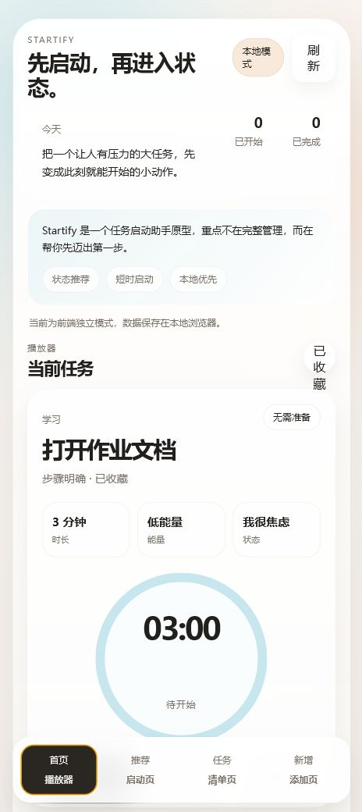
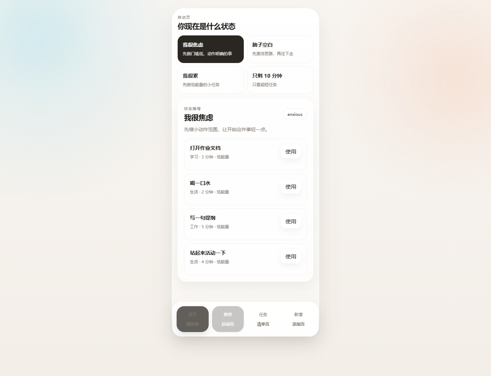
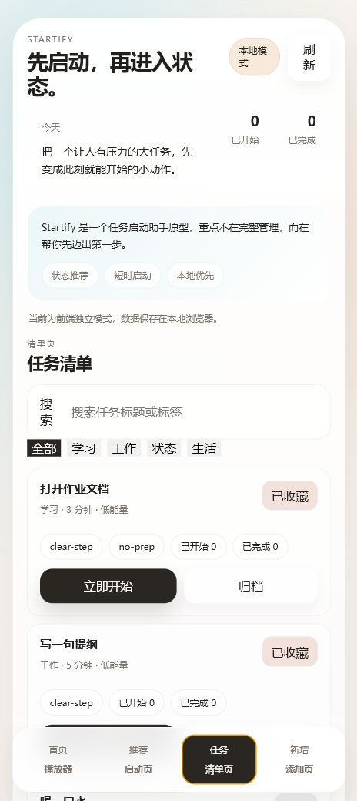
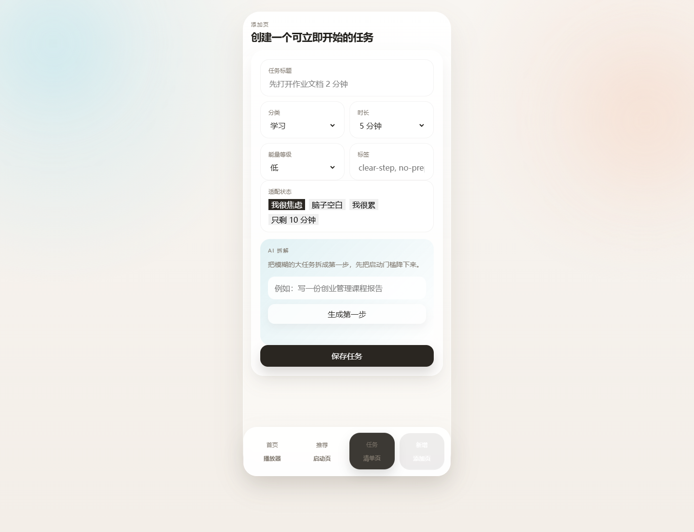

# Startify

一个帮助用户跨过“知道该做什么，却迟迟开始不了”这道门槛的任务启动助手。Startify 根据用户当前状态推荐低阻力任务，把模糊目标缩成第一步，并用短时计时推动真实行动。

[在线体验](https://luxury-flan-6ad34b.netlify.app/) · [查看源码](https://github.com/Ruij-Wang/Startify) · [查看页面截图](#页面展示)

> 在线页面当前可以直接体验任务推荐、计时、清单和创建流程。创建任务时可通过 Netlify Function 调用 DeepSeek 生成第一步；服务不可用时页面会回退到本地规则演示并明确标注。

## 页面展示

<table>
  <tr>
    <th width="50%">播放器｜聚焦当前任务</th>
    <th width="50%">状态推荐｜匹配当下状态</th>
  </tr>
  <tr>
    <td></td>
    <td></td>
  </tr>
  <tr>
    <td align="center">查看任务、时长、能量和计时状态，立即开始行动。</td>
    <td align="center">选择焦虑、疲惫等状态，获得更容易启动的任务。</td>
  </tr>
</table>

<table>
  <tr>
    <th width="50%">任务清单｜集中管理任务</th>
    <th width="50%">创建任务｜AI 生成第一步</th>
  </tr>
  <tr>
    <td></td>
    <td></td>
  </tr>
  <tr>
    <td align="center">搜索、筛选、收藏、启动或归档已有任务。</td>
    <td align="center">填写模糊目标，通过 DeepSeek 生成可立即执行的第一步。</td>
  </tr>
</table>

## 产品问题

传统任务管理工具擅长记录和规划，启动困难仍然留给用户自己解决。Startify 聚焦行动发生前的几分钟：用户可能焦虑、疲惫、脑子空白，也可能只有十分钟空档。产品先判断当前状态，再给出一个足够小、准备成本足够低的动作。

## 核心体验

1. 用户选择“焦虑、脑子空白、疲惫、只剩十分钟”等当前状态。
2. 系统按时长、能量需求、准备成本和状态标签推荐更容易开始的任务。
3. 用户进入播放器，用 2～10 分钟短计时启动行动。
4. 完成、跳过和会话记录形成轻量反馈，不要求维护复杂项目结构。
5. 创建大任务时，智能拆解把目标缩成可以立即执行的第一步。

## 核心产品决策

- **聚焦启动**：功能围绕“下一步做什么”和“现在开始”展开，控制任务管理复杂度。
- **状态驱动推荐**：推荐依据当前心理和时间状态，不只按优先级排序。
- **本地优先**：没有后端时仍可完整体验，任务和会话保存在当前浏览器。
- **AI 透明标注**：调用大模型时显示“大模型 API”；API 不可用时回退到规则演示并明确标注。
- **逐步增强**：静态网页提供最低体验门槛，FastAPI + SQLite 支持持久化，服务端 API 提供真实任务拆解。

## 当前能力

- 四个可操作页面：播放器、状态推荐、任务清单、创建任务。
- 任务创建、搜索、收藏、归档和设为当前任务。
- 会话开始、暂停、完成、跳过和基础统计。
- 规则推荐与浏览器 LocalStorage 独立运行模式。
- FastAPI 任务、会话、推荐、健康检查和智能拆解接口。
- SQLite 持久化与文件数据库失败时的内存回退。
- OpenAI-compatible 大模型 API 适配与 Netlify Function。

## 运行

### 只体验前端

直接打开 `index.html`，或使用任意静态文件服务器。后端不可用时会切换到浏览器本地模式。

### 运行完整前后端

```powershell
cd backend
pip install -r requirements.txt
uvicorn app.main:app --reload
```

访问：

- 应用：`http://127.0.0.1:8000/`
- API 文档：`http://127.0.0.1:8000/docs`
- 健康检查：`http://127.0.0.1:8000/api/health`

## 测试

```powershell
cd backend
python -m unittest -v
```

测试覆盖任务 CRUD、种子任务、推荐、会话计数、mock 拆解和已配置模型供应商的返回解析。

## 当前限制

- Netlify 线上站点尚未重新部署本地最新版，真实 AI Function 暂未在公网生效。
- 在线大模型效果取决于服务端环境变量、供应商可用性和调用额度。
- 本地模式和后端模式的数据不会自动同步。
- 当前按单用户原型设计，没有账号、权限和跨设备同步。

## 技术实现

- Frontend：HTML / CSS / JavaScript
- Backend：FastAPI / SQLAlchemy / SQLite
- AI：OpenAI-compatible Chat Completions API
- Online function：Netlify Functions
- Tests：Python `unittest` / FastAPI `TestClient`
